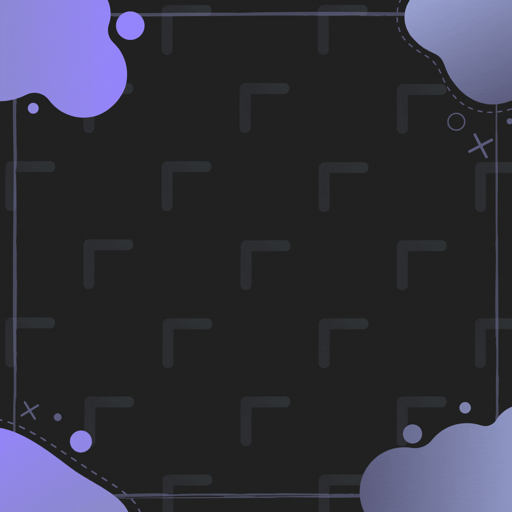

<!-- 
--primary-color: #9FA8DA;159,168,218
--background-color: #212121; rgb(33,33,33)
-->

	
	  

	
	
	
	
	
	
	
	
	
	
	<!-- 
	 -->

	 
	
	

<!--    -->
<!--
**MainKronos/MainKronos** is a ✨ _special_ ✨ repository because its `README.md` (this file) appears on your GitHub profile.
-->
