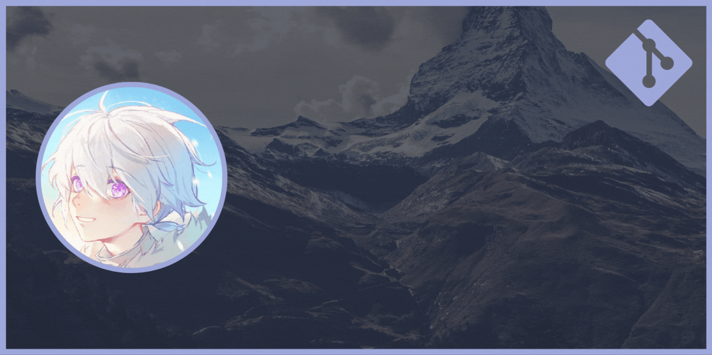
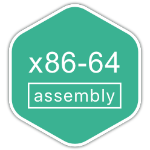

<!-- 
--primary-color: #9FA8DA;159,168,218
--background-color: #212121; rgb(33,33,33)
-->

	
	

<h2 align="center"> ~ 🌧 About me 🌧 ~</h2>

- 👋 Hi, I’m Lorenzo
- 🎒 I'm a Computer Engineering Student
- 📺 I loves anime and manga
- 🦊 Gender: Male
- ⏳ Age: 23 years old
- ⚡ Fun fact: I don't have a girlfriend 🌧
- 📫 How to reach me:  

<h2 align="center">~ 📑 Recent Activity 📑 ~</h2>

<!-- BEGIN ACTIVITY -->

### 🔓 [MainKronos](https://github.com/MainKronos/MainKronos)
> My GitHub Profile README.
- 📌 [Update sponsors](https://github.com/MainKronos/MainKronos/commit/b1b853ebe0c7cb6a9fadaa81e9949ccc735d3105)
- 📌 [Update README.md](https://github.com/MainKronos/MainKronos/commit/0f8b8a8c1b900c49365e2f400b12026d35c96cf0)
- 📌 [fix](https://github.com/MainKronos/MainKronos/commit/dade37c4c67b45beb586072c2907377df2d6f8a3)
### 🔓 [Sonarr-AnimeDownloader](https://github.com/MainKronos/Sonarr-AnimeDownloader)
> It is a Docker Container that uses Sonarr to download anime from AnimeWorld site (ITALY).
- 📌 [Merge pull request #145 from MainKronos/dev](https://github.com/MainKronos/Sonarr-AnimeDownloader/commit/7f3bb90e79ab3e8e7382cd3bc6ca4422a08f20ae)
- 📌 [Merge branch 'main' into dev](https://github.com/MainKronos/Sonarr-AnimeDownloader/commit/ebf9113aabc45e0cdce51145e6caecfbb07b8747)
- 📌 [fix start.c](https://github.com/MainKronos/Sonarr-AnimeDownloader/commit/39fd00c307c9c8cdd9b41ef98a7791696e86b4dd)
### 🔓 [HttpServer](https://github.com/MainKronos/HttpServer)
> Micro http library written in c [UNIX]
- 📌 [url_callback](https://github.com/MainKronos/HttpServer/commit/c9bb25d8b84c6799f531b295cb8197de938f6d4e)
- 📌 [http_request_get_url](https://github.com/MainKronos/HttpServer/commit/844387b5325e539eebb9be5011613ef245008851)
- 📌 [update](https://github.com/MainKronos/HttpServer/commit/87900aee5a8c860aba5c85e3e0ea4047e1e1a020)

<!-- END ACTIVITY -->

<h2 align="center">~ 💻 Tech Stack 💻 ~</h2>

	
	
	
	
	
	
    
	
	
	
	
	
	
	<!--   -->
	    
    
    
	
	
	
	
	
	
	
	            

<h2 align="center">~ 📊 GitHub Profile Stats 📊 ~</h2>

	 
	
	

<h2 align="center">~ 🥇 Badge 🥇 ~</h2>

<h2 align="center">~ ✍️ Dev Quote ✍️ ~</h2>

<!-- BEGIN QUOTE -->

<!-- END QUOTE -->

	 
	 
	

<!--
**MainKronos/MainKronos** is a ✨ _special_ ✨ repository because its `README.md` (this file) appears on your GitHub profile.
-->
